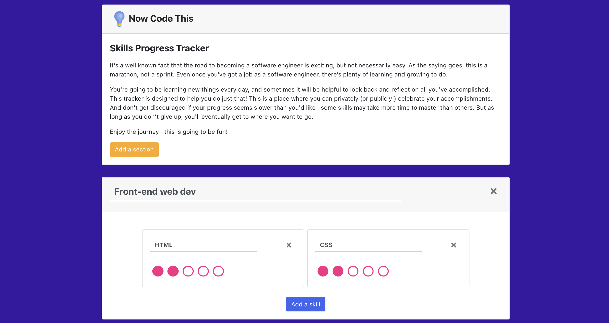

# Skills Progress Tracker

The Skills Progress Tracker tracker is designed to help software engineers of all levels track progress toward personal growth goals and privately (or publicly!) celebrate accomplishments.

This tracker starts out with default values and allows users to add, update, and delete categories and skills. When a new skill level is achieved, there’s a fun “celebration.” All changes are saved to local storage for future use.

You can view this project [here](https://nowcodethis-skills-progress-tracker.netlify.app/).
